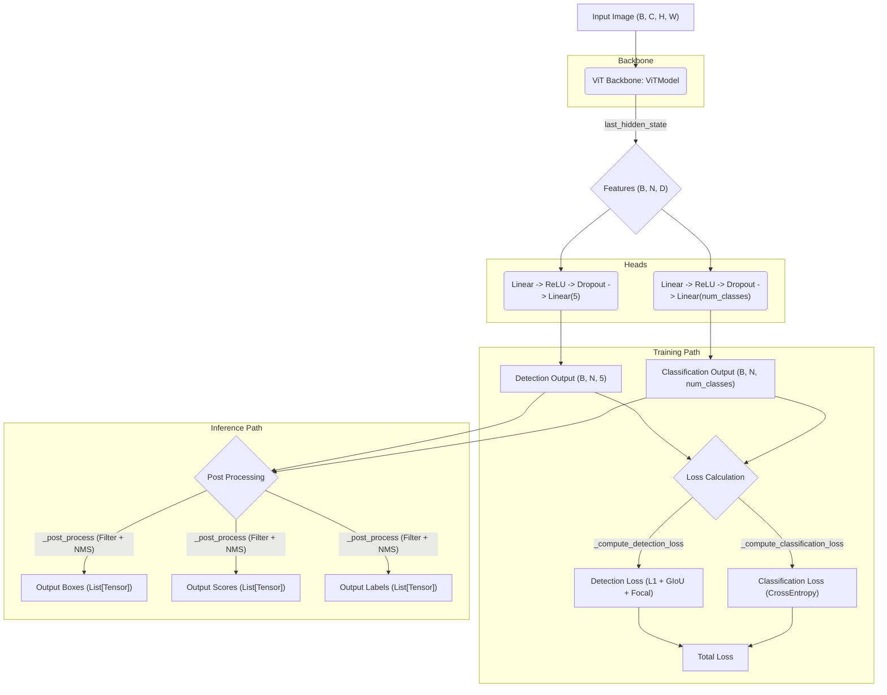

# Character Detection Model Architecture

## Explanation

1.  **Input Image**: Model input image (Batch size B, Channels C, Height H, Width W).
2.  **ViT Backbone**: Uses `ViTModel` from the `transformers` library as the backbone to extract `Features` from the image.
3.  **Features**: Features output from the backbone (Batch size B, Number of patches N, Hidden dimension D).
4.  **Detection Head**: Head that predicts bounding boxes (x1, y1, x2, y2) and confidence from the features.
5.  **Classification Head**: Head that predicts the character class within each bounding box from the features.
6.  **Training Path**: During training, calculates the loss (Detection Loss and Classification Loss) using the outputs of the Detection Head and Classification Head, and the ground truth labels.
7.  **Inference Path**: During inference, post-processes the outputs of the Detection Head and Classification Head (filtering by confidence, Non-Maximum Suppression (NMS)) to output the final bounding boxes, scores, and labels.
